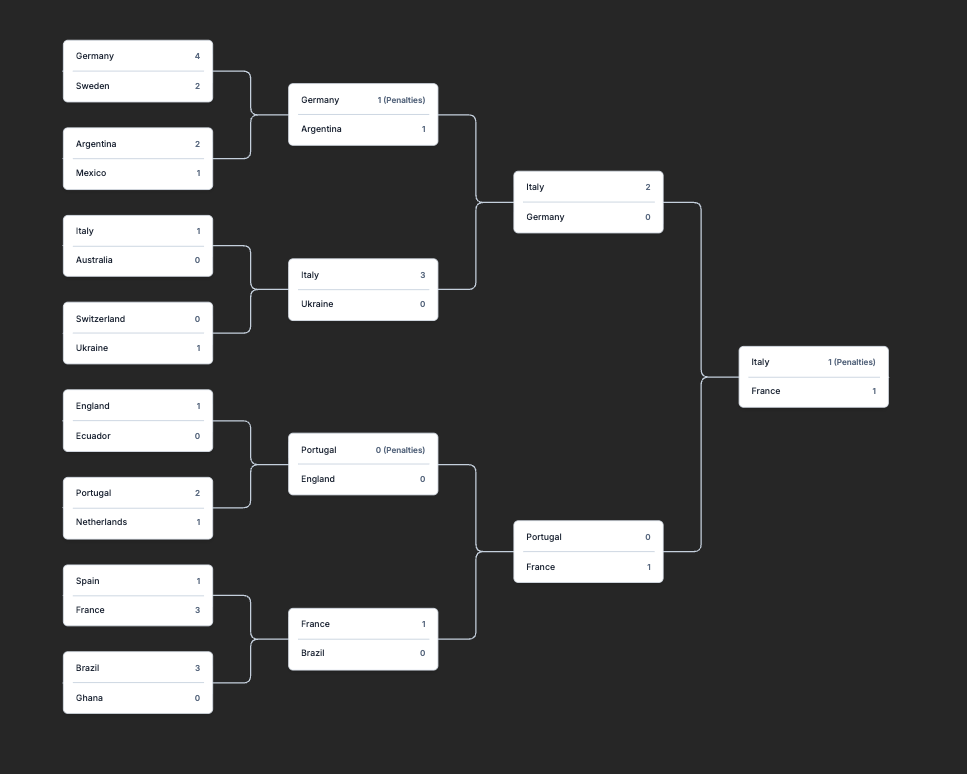
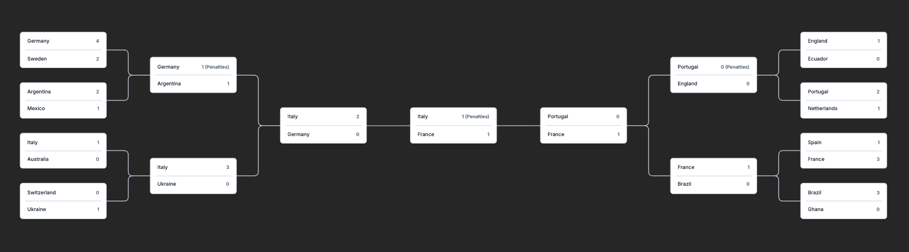

# React Playoff

[](https://github.com/alicompiler/react-playoff/actions/workflows/deploy.yml)
[](https://alicompiler.github.io/react-playoff/)

A React component library for rendering playoff brackets. It provides a flexible and customizable way to display tournament structures, allowing you to create visually appealing and interactive playoff brackets for various sports and competitions.

**Demo: [alicompiler.github.io/react-playoff](https://alicompiler.github.io/react-playoff/)**


*Modern Tree Layout*


*Standard Wings Layout*

## Features

- **Performant**: Built with React and optimized for smooth interactions.
- **Dual Layouts**: Supports both traditional **Tree** (vertical) and **Wings** (center-converging) layouts.
- **Interactive**: Built-in support for **Zooming** (mouse wheel) and **Panning** (click and drag).
- **Fully Customizable**: Override default match rendering with your own components.
- **Dynamic Styling**: Easy to theme using CSS variables.
- **TypeScript Support**: Full type safety for your tournament data.

## Installation

```bash
npm install react-playoff
# or
yarn add react-playoff
```

## Quick Start

```tsx
import { PlayOff, Rounds } from 'react-playoff';
import 'react-playoff/dist/index.css';

const rounds: Rounds = [
    [
        { id: '1', home: { name: 'Italy' }, away: { name: 'Germany' }, nextMatchId: '3', score: [{ home: '2', away: '1' }] },
        { id: '2', home: { name: 'France' }, away: { name: 'Spain' }, nextMatchId: '3', score: [{ home: '1', away: '0' }] }
    ],
    [
        { id: '3', home : { name: 'Italy' }, away: { name: 'France' }, nextMatchId: '__final__' }
    ]
];

const App = () => (
    <div style={{ width: '100vw', height: '100vh' }}>
        <PlayOff 
            rounds={rounds} 
            layout="tree" 
        />
    </div>
);
```

## Data Structure

The library relies on a simple hierarchical structure defined by the `Rounds` type.

### `Rounds`

`Rounds` is an array of rounds, where each round is an array of matches.
top rounds is the first round, and bottom rounds is the last round.

for example, if you have 32 teams, you will have 5 rounds: round of 32, round of 16, quarter finals, semi finals, and final.

the order of the rounds is from top to bottom.

### `Match` Object
| Property | Type | Description |
| :--- | :--- | :--- |
| `id` | `string` | Unique identifier for the match. |
| `home` | `Participant` | The "home" team/player object. |
| `away` | `Participant` | The "away" team/player object. |
| `nextMatchId` | `string` | The ID of the match where the winner moves. Use `__final__` for the championship match. |
| `score` | `Array` | (Optional) Array of scores (e.g., for sets or series). Format: `{ home: string, away: string }[]`. |
| `metadata` | `Record` | (Optional) Any extra data you want to pass to your custom match renderer. |

### `Participant` Object
| Property | Type | Description |
| :--- | :--- | :--- |
| `name` | `string` | The name displayed for the team or player. |

## Component Props

| Prop | Type | Default | Description |
| :--- | :--- | :--- | :--- |
| `rounds` | `Rounds` | **Required** | The array of rounds and matches. |
| `layout` | `'tree' \| 'wings'` | **Required** | The layout style of the bracket. |
| `renderMatch` | `RenderMatchFunc` | `DefaultMatch` | Custom function to render each match component. |
| `renderPaths` | `boolean` | `true` | Whether to draw the SVG lines connecting matches. |

## Customization

### 1. Custom Match Rendering
You can completely take over how each match is displayed.

```tsx
const customRender: RenderMatchFunc = (match, { selectedTeam, setSelectedTeamName }) => (
    <div className="custom-match">
        <div onClick={() => setSelectedTeamName(match.home.name)}>
            {match.home.name} - {match.score?.[0].home}
        </div>
        <div onClick={() => setSelectedTeamName(match.away.name)}>
            {match.away.name} - {match.score?.[0].away}
        </div>
    </div>
);

<PlayOff rounds={rounds} layout="wings" renderMatch={customRender} />
```

### 2. Styling with CSS

you can override the default styles by adding your own styles to the component.

```css
/* class added to the root element */
.__playoff-root { }

/* classes added to the root element based on the layout */
.__playoff-layout-tree { }
.__playoff-layout-wings { }

/* class added to the root element when dragging */
.__playoff-dragging { }

/* ------------------ */

/* class added to the content element */
.__playoff-content {}


/* ------------------ */

/* class added to the svg element of the connectors */
.__playoff-connectors {}


/* ------------------ */

/* class added to the default match element */
.__playoff-default-match {}

/* class added to the home team element in the default match */
.__playoff-default-match-home {}

/* class added to the away team element in the default match */
.__playoff-default-match-away {}

/* class added to the team element when selected in the default match */
.__playoff-team-selected {}


/* ------------------ */


/* class added to the match container element */
.__playoff-match-container {}


/* ------------------ */

/* class added to the path element */
.__playoff-path {}

/* class added to the path element when highlighted */
.__playoff-path-highlighted {}


/* ------------------ */


/* class added to the round column element */
.__playoff-round-column {}
```

you may need to add `!important` to the styles to override the default styles.

## Interaction

- **Zoom**: Use your mouse wheel or trackpad pinch-to-zoom over the bracket area.
- **Pan**: Click and drag anywhere in the empty space of the bracket to move it around.
- **Highlighting**: Clicking a team name (in the default renderer) will highlight their entire path through the tournament.

## Contributing

Contributions are welcome! Whether you're reporting a bug, suggesting a feature, or submitting a pull request, we appreciate your help.

### Development Setup

1. **Clone the repository**:
   ```bash
   git clone https://github.com/alicompiler/react-playoff.git
   cd react-playoff
   ```
2. **Install dependencies**:
   ```bash
   npm install
   ```
3. **Run the development server**:
   ```bash
   npm run dev
   ```

### Testing

We use [Vitest](https://vitest.dev/) for testing. Please ensure all tests pass before submitting a PR.
```bash
npm test
```

### Submitting a PR

1. Fork the repository.
2. Create a new branch: `git checkout -b feature/your-feature-name`.
3. Make your changes and commit them: `git commit -m 'Add some feature'`.
4. Push to the branch: `git push origin feature/your-feature-name`.
5. Open a pull request.

## License

MIT © [Ali]
